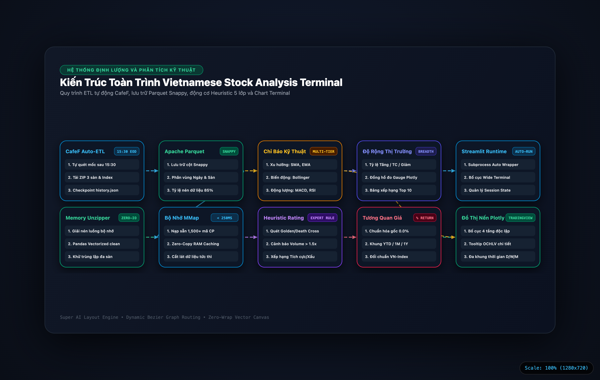

# diagram-maker

[](https://www.python.org/)
[](LICENSE)
[]()
[]()
[]()

Bộ máy tự động chuyển đổi các tệp đặc tả JSON thành Sơ đồ Kiến trúc Vector (Architecture Flowcharts) và Bản trình chiếu chuyên nghiệp (Presentation Decks) theo chuẩn thiết kế **Institutional Financial Terminal**, đảm bảo cơ chế **Zero-Wrap Canvas** (tuyệt đối không vỡ chữ khi co giãn màn hình) và định tuyến dây kết nối Bezier vector tự động.

---

## 1. Triết Lý Thiết Kế & Điểm Nhấn Kỹ Thuật

### A. Chuẩn Mực Institutional Financial Terminal
* **Bảng màu Neo-Dark chuẩn mực:** Sử dụng phông nền sâu `#0a0e17` kết hợp các gam màu chức năng có chủ đích: Xanh lục (`#34d399`), Xanh dương (`#38bdf8`), Tím trần (`#c084fc`), Vàng hổ phách (`#fbbf24`), và Đỏ hồng (`#fb7185`).
* **Zero-Emoji Policy:** Loại bỏ toàn bộ icon hoạt họa, giữ vẻ tinh tế, chỉn chu và nghiêm túc của thiết bị đầu cuối dữ liệu tài chính cấp tổ chức.
* **Bộ đo đệm động Illustrator (Dynamic Extra Width):** Tính toán độ rộng nhãn danh mục theo công thức `cat_badge_w = len(category) * 7.6 + 46`, loại bỏ hiện tượng chữ chạm mép bo tròn góc `rx = 12px`.

### B. Cơ Chế Zero-Wrap Vector Canvas (1280x720)
* Đồ thị được đóng gói trong một không gian vector tỷ lệ cố định $1280 \times 720$.
* Tự động thích ứng kích thước cửa sổ trình duyệt (AutoScale) mà không làm nhảy dòng tiêu đề hoặc thay đổi khoảng cách vật lý giữa các khối xử lý.

### C. Định Tuyến Dây Bezier Động & Mũi Tên Chỉ Hướng
* Tự động tính toán tiếp điểm xuất phát và tiếp điểm đích của các luồng dữ liệu.
* Dây nối Cubic Bezier mềm mại với độ uốn cong tự nhiên:
  $$C_1 = (x_1 + dx \times 0.5, y_1), \quad C_2 = (x_2 - dx \times 0.5, y_2)$$
* Gắn marker mũi tên vector SVG (`<marker id="arrow-{color}">`) tiếp xúc chuẩn xác vào đường viền hộp đích.

---

## 2. Hình Ảnh Trực Quan Từ Các Dự Án Thực Tế

### A. Kiến Trúc Toàn Trình Telegram Stock Bot (5 Tầng)
Sơ đồ mô tả quy trình tiếp nhận dữ liệu nến siêu tốc, xử lý chống chặn WAF, tính toán chỉ báo kỹ thuật kết hợp CANSLIM và xuất đồ thị nến:

<p align="center">
  
</p>

### B. Kiến Trúc Toàn Trình Vietnam Stock Real-Time Heatmap (5 Tầng)
Sơ đồ luồng xử lý luồng SignalR SSI 2,500+ tick/s, In-Memory Store O(1) và Treemap ECharts:

<p align="center">
  
</p>

### C. Kiến Trúc Toàn Trình Vietnamese Stock Analysis Terminal (5 Tầng)
Sơ đồ quy trình ETL CafeF tự động, lưu trữ cột Apache Parquet và bộ nhớ đệm Memory-Mapped:

<p align="center">
  
</p>

---

## 3. Cấu Trúc Cây Thư Mục Dự Án

```
diagram-maker/
├── main.py                        # Entrypoint 1-Click Run & CLI
├── requirements.txt               # Danh mục phụ thuộc (Zero-Dependency)
├── LICENSE                        # Giấy phép nguồn mở MIT
├── README.md                      # Tài liệu kỹ thuật
│
├── src/                           # Mã nguồn lõi (Core Engine)
│   ├── __init__.py                # Khởi tạo package và xuất các hàm biên dịch
│   ├── compiler.py                # GraphCompiler: Tính toán DAG Auto-Layout, Bezier vector
│   ├── slide_compiler.py          # SlideCompiler: Kết xuất slide thuyết trình
│   └── cli.py                     # Bộ điều khiển dòng lệnh CLI
│
├── schemas/                       # Lược đồ JSON Schema chuẩn hóa
│   ├── diagram_spec.schema.json   # Schema cho sơ đồ kiến trúc quy trình (4-5 columns)
│   └── slide_spec.schema.json     # Schema cho bản trình chiếu thuyết trình
│
├── specs/                         # Thư mục chứa các tệp đặc tả JSON
│   ├── samples/                   # File mẫu thử nghiệm
│   │   ├── sample_diagram.json
│   │   └── sample_slide.json
│   └── projects/                  # Bộ đặc tả thực tế của các hệ thống
│       ├── telegram_stock_bot_5tier.json
│       ├── vietnam_stock_heatmap_5tier.json
│       ├── vietnamese_stock_analysis_5tier.json
│       ├── vietnam_stock_heatmap_4tier.json
│       └── vietnamese_stock_analysis_4tier.json
│
├── output/                        # Thư mục xuất bản các tệp HTML vector tương tác
│   ├── diagram_telegram_stock_bot_5tier.html
│   ├── diagram_vietnam_stock_heatmap_5tier.html
│   ├── diagram_vietnamese_stock_analysis_5tier.html
│   └── ...
│
└── assets/                        # Ảnh chụp kết quả độ phân giải cao phục vụ tài liệu
    ├── telegram_stock_bot_architecture_5tier.png
    ├── vietnam_stock_heatmap_5tier.png
    └── vietnamese_stock_analysis_5tier.png
```

---

## 4. Hướng Dẫn Sử Dụng

### Yêu Cầu Môi Trường
* Python >= 3.10
* Không cần cài đặt thêm bất kỳ thư viện bên ngoài nào (Zero Dependency, hoàn toàn sử dụng thư viện tiêu chuẩn).

### 1-Click Chạy Biên Dịch Toàn Bộ
Để tự động quét và biên dịch toàn bộ các tệp đặc tả trong thư mục `specs/` sang thư mục `output/`:
```bash
python3 main.py
```
Hoặc dùng tùy chọn cờ tường minh:
```bash
python3 main.py --all
```

### Biên Dịch Riêng Lẻ Từng File Đặc Tả
```bash
# Biên dịch sơ đồ Telegram Stock Bot
python3 main.py specs/projects/telegram_stock_bot_5tier.json

# Biên dịch ra file HTML tùy chọn
python3 main.py specs/projects/vietnam_stock_heatmap_5tier.json -o output/custom_heatmap.html
```

### Xem Trực Tiếp Trên Trình Duyệt
```bash
open output/diagram_telegram_stock_bot_5tier.html
open output/diagram_vietnam_stock_heatmap_5tier.html
open output/diagram_vietnamese_stock_analysis_5tier.html
```

---

## 5. Quy Chuẩn Đặc Tả Cấu Trúc JSON (DSL)

Mỗi sơ đồ kiến trúc được khai báo thông qua một tệp JSON với cấu trúc rõ ràng:

```json
{
  "title": "Kiến Trúc Hệ Thống",
  "category": "QUY TRÌNH VẬN HÀNH",
  "subtitle": "Mô tả chi tiết các phân tầng dữ liệu",
  "columns": [
    {
      "name": "TẦNG 1: NGUỒN DỮ LIỆU",
      "nodes": [
        {
          "id": "node_api",
          "title": "REST API Gateway",
          "badge": "< 100MS",
          "color": "sky",
          "items": [
            "1. Xác thực bảo mật Token",
            "2. Nạp dữ liệu bất đồng bộ",
            "3. Kiểm soát tần suất gọi API"
          ]
        }
      ]
    }
  ],
  "connections": [
    {
      "from": "node_api",
      "to": "node_storage",
      "color": "sky"
    }
  ]
}
```

---

## 6. Giấy Phép (License)

Dự án được phân phối dưới giấy phép mã nguồn mở [MIT License](LICENSE).
