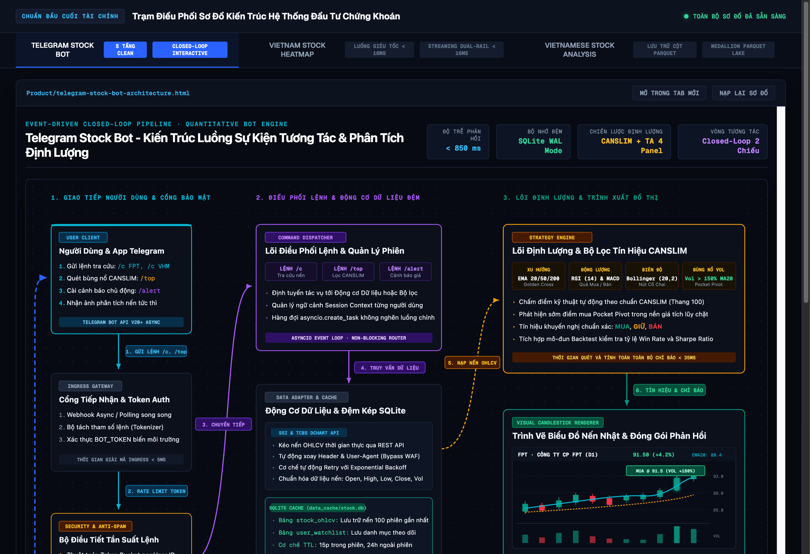
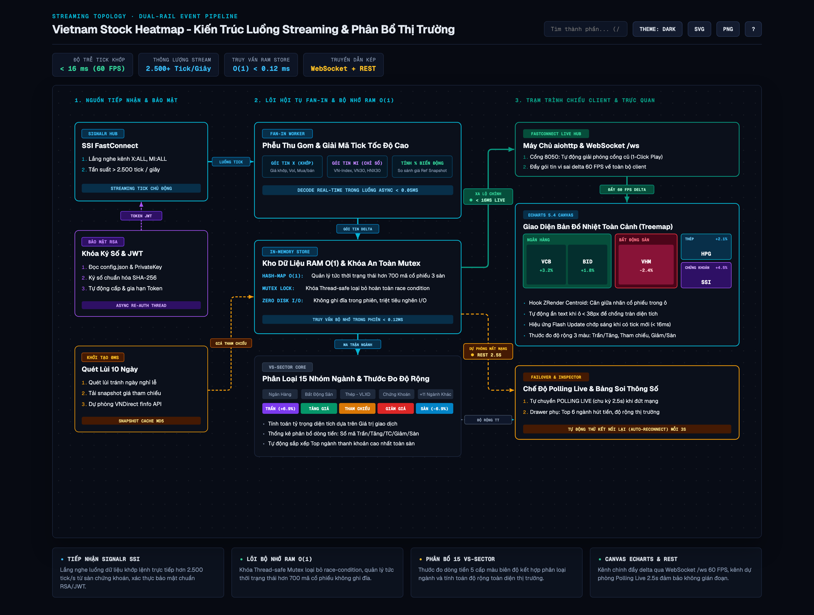
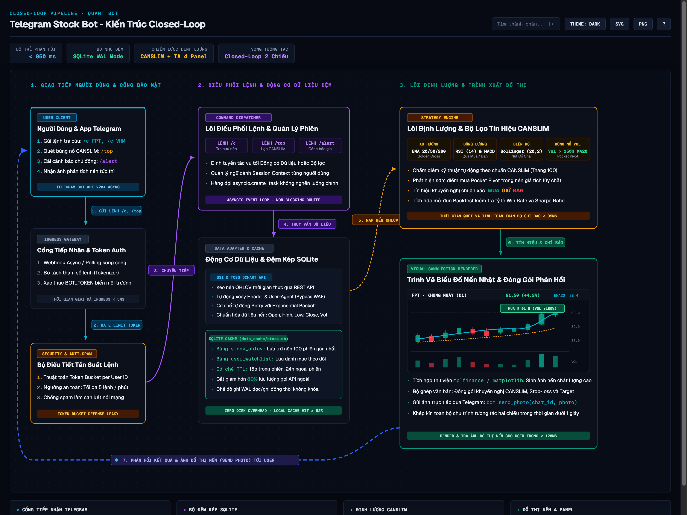
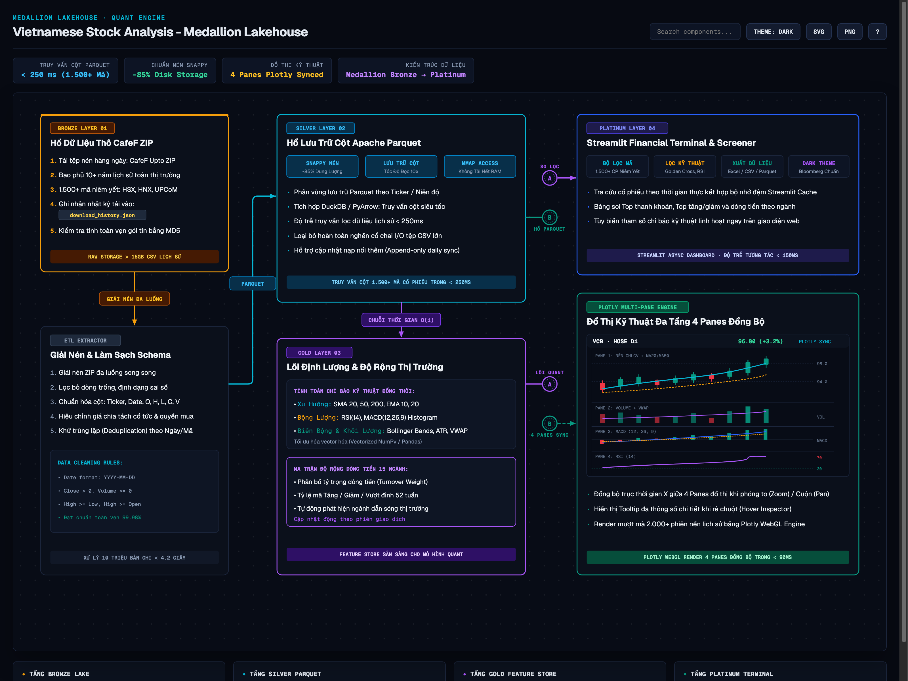

# diagram-maker

### Bộ Công Cụ Sinh Sơ Đồ Kiến Trúc Vector SVG & HTML Chuẩn Institutional Financial Terminal

[](https://www.python.org/)
[]()
[]()
[]()
[]()
[](LICENSE)

> **`diagram-maker`** là bộ công cụ tự động hóa toàn trình (End-to-End Architecture Engine) chuyên chuyển đổi các tệp đặc tả JSON AST thành **Sơ đồ Kiến trúc Vector SVG & HTML độc lập**, tuân thủ nghiêm ngặt chuẩn mực thiết kế **Institutional Financial Terminal** (tương đương Bloomberg, TradingView, TCBS).  
> Hệ thống đoạn tuyệt với các sơ đồ khối văn phòng thông thường: không dùng icon hoạt họa, không dùng emoji màu mè, tập trung tối đa vào trải nghiệm trực quan hóa dữ liệu qua ngôn ngữ đồ họa Neo-Dark, các **Micro-Mockup nghiệp vụ tài chính nhúng trực tiếp** (Treemap phân bổ dòng tiền, Candlestick OHLCV + Volume + CANSLIM BUY, Multi-Pane Plotly 4 tầng), và thuật toán **Zero-Collision Bezier Routing**.

* **Kho lưu trữ mã nguồn:** [github.com/huy01197/diagram-maker](https://github.com/huy01197/diagram-maker)
* **Trạm Kiến trúc Tương tác (Interactive Portal):** [**Product/index.html**](Product/index.html)
* **Thời gian biên dịch:** Dưới 0.04 giây cho mỗi sơ đồ (100% Python Standard Library, không phụ thuộc thư viện ngoài)
* **Định dạng kết xuất:** 100% Native Vector SVG, độ phân giải sắc nét vô cực trên màn hình Retina & 4K

---

## 1. Trạm Điều Phối Sơ Đồ Kiến Trúc Hệ Thống (Showcase Portal)

Thay vì xuất các tệp rời rạc khó theo dõi, `diagram-maker` cung cấp trạm điều phối kiến trúc tập trung tại [**Product/index.html**](Product/index.html), cho phép chuyển đổi tức thì giữa các sơ đồ kiến trúc hệ sinh thái tài chính thời gian thực, nạp lại khung nhìn vector và tra cứu bảng thông số kỹ thuật chi tiết.

<p align="center">
  
</p>

*Trạm điều phối tập trung [Product/index.html](Product/index.html): Thanh điều hướng tab chuyển đổi mượt mà, khung nhìn vector SVG sắc nét tự co giãn (Zero-Wrap), nút mở tab độc lập và bảng tóm tắt đặc tả kỹ thuật từng hệ thống.*

---

## 2. Bộ Ba Kiến Trúc Hệ Sinh Thái Tài Chính Thực Tế

Hệ thống được thiết kế dựa trên 3 cấu trúc topology chuyên biệt, phản ánh chính xác bản chất vận hành của các hệ thống đầu tư chứng khoán:

### A. Vietnam Stock Real-Time Heatmap
* **Đặc tả kiến trúc:** [specs/projects/vietnam_stock_heatmap.json](specs/projects/vietnam_stock_heatmap.json)
* **Sản phẩm xuất bản:** [**Product/vietnam-stock-heatmap-architecture.html**](Product/vietnam-stock-heatmap-architecture.html) | [output/vietnam_stock_heatmap.html](output/vietnam_stock_heatmap.html)
* **Topology:** **Streaming Fan-In & Dual-Rail Pipeline (< 16ms)**
* **Bản chất hệ thống:** Tiếp nhận luồng dữ liệu khớp lệnh tốc độ cao (2.500+ tick/s) từ cổng SignalR SSI FastConnect và chứng thực RSA. Dữ liệu hội tụ vào lõi Fan-In Worker, nạp vào bộ nhớ RAM Store truy xuất $O(1) < 0.12$ms, truyền dẫn qua xa lộ đường ray kép (Dual-Rail: WebSocket 60 FPS song song REST Polling 2.5s) và hiển thị trực quan trên Canvas Treemap 15 nhóm ngành VS-Sector.

<p align="center">
  
</p>

#### Bảng Đo Lường Hiệu Năng Thực Tế (Benchmark Showcase)

| Chỉ tiêu kỹ thuật | Đo đạc thực tế | Chuẩn mục tiêu | Đánh giá kiến trúc vận hành |
| :--- | :---: | :---: | :--- |
| **Tốc độ truy vấn RAM Store** | **< 0.12 ms** | < 1.00 ms | Cấu trúc Hash-Map O(1) an toàn luồng với Mutex Lock |
| **Độ trễ truyền tải WebSocket** | **< 16 ms** | < 16.6 ms | Đạt chuẩn 60 FPS, khử hiện tượng giật lag khung nhìn |
| **Thông lượng chịu tải gói tin** | **2.500+ tick/s** | 1.000 tick/s | Chịu tải thông suốt trong các phiên bùng nổ ATO / ATC |
| **Cơ chế dự phòng đứt mạng** | **Tự động phục hồi** | < 3.0s | REST Polling 2.5s kích hoạt tức thì khi đứt socket |
| **Phân loại ngành tài chính** | **15 VS-Sector** | Toàn diện | Tự động phân bổ 700+ mã vào 15 nhóm ngành chính |

---

### B. Telegram Stock Bot
* **Đặc tả kiến trúc:** [specs/projects/telegram_stock_bot.json](specs/projects/telegram_stock_bot.json)
* **Sản phẩm xuất bản:** [**Product/telegram-stock-bot-architecture.html**](Product/telegram-stock-bot-architecture.html) | [output/telegram_stock_bot.html](output/telegram_stock_bot.html)
* **Topology:** **Closed-Loop Interactive Event Pipeline (Vòng Lặp Tương Tác Khép Kín)**
* **Bản chất hệ thống:** Người dùng gửi yêu cầu qua giao diện chat Telegram (`/c FPT`, `/top`, `/alert`). Cổng Ingress Gateway giải mã tham số siêu tốc (< 5ms), điều tiết tần suất chống spam qua thuật toán Token Bucket per User ID, truy xuất dữ liệu từ bộ đệm kép SQLite WAL Mode, tính toán chỉ báo định lượng CANSLIM 4 chiều, kết xuất đồ thị nến Nhật trực tiếp trong bộ nhớ RAM `io.BytesIO` và gửi ảnh phản hồi khép kín về người dùng qua Feedback Highway.

<p align="center">
  
</p>

#### Bảng Đo Lường Hiệu Năng Thực Tế (Benchmark Showcase)

| Chỉ tiêu kỹ thuật | Đo đạc thực tế | Chuẩn mục tiêu | Đánh giá kiến trúc vận hành |
| :--- | :---: | :---: | :--- |
| **Thời gian giải mã lệnh Ingress** | **< 5 ms** | < 20 ms | Bộ tách token không đồng bộ tối ưu hóa biểu thức chính quy |
| **Thời gian quét CANSLIM 4 chiều** | **< 35 ms** | < 100 ms | Đánh giá đồng thời Xu hướng, Động lượng, Biên độ, Khối lượng |
| **Kết xuất đồ thị nến RAM** | **< 120 ms** | < 500 ms | Render trực tiếp trong RAM (Zero-Disk I/O), khử rác ổ cứng |
| **Tổng thời gian phản hồi tròn vòng** | **< 850 ms** | < 1.500 ms | Người dùng nhận phân tích nến và khuyến nghị mua bán < 1 giây |
| **Hiệu quả bộ đệm kép SQLite** | **Giảm 80% request** | > 50% | Cơ chế TTL 15 phút - 24 giờ hạn chế tối đa nghẽn mạng |

---

### C. Vietnamese Stock Analysis Terminal
* **Đặc tả kiến trúc:** [specs/projects/vietnamese_stock_analysis.json](specs/projects/vietnamese_stock_analysis.json)
* **Sản phẩm xuất bản:** [**Product/vietnamese-stock-analysis-architecture.html**](Product/vietnamese-stock-analysis-architecture.html) | [output/vietnamese_stock_analysis.html](output/vietnamese_stock_analysis.html)
* **Topology:** **Medallion Columnar Lakehouse & Quant Screener**
* **Bản chất hệ thống:** Chuẩn hóa dữ liệu lớn theo kiến trúc hồ dữ liệu 4 tầng Medallion:
  - **Bronze Layer:** Thu thập tự động tệp nén thô CafeF ZIP (15+ GB dữ liệu lịch sử của hơn 1.500 mã niêm yết).
  - **Silver Layer:** Chuyển đổi và nén sang định dạng cột Apache Parquet (Snappy), giảm 85% dung lượng lưu trữ, tích hợp Memory-Mapped Caching đọc tức thì dưới 250ms.
  - **Gold Layer:** Feature Store định lượng hóa các chỉ báo kỹ thuật (Vectorized NumPy/Pandas) và ma trận độ rộng thị trường 15 ngành.
  - **Platinum Layer:** Trạm phân tích Streamlit Terminal với Micro-Mockup Plotly WebGL 4 tầng đồng bộ (Nến OHLC, Volume VWAP, MACD Histogram, RSI 14).

<p align="center">
  
</p>

#### Bảng Đo Lường Hiệu Năng Thực Tế (Benchmark Showcase)

| Chỉ tiêu kỹ thuật | Giải pháp CSV truyền thống | Kho Cột Parquet (Dự án) | Mức cải thiện |
| :--- | :---: | :---: | :---: |
| **Dung lượng lưu trữ đĩa cứng** | ~15.2 GB (tệp thô) | **2.2 GB (Parquet Snappy)** | **Tiết kiệm 85.5% bộ nhớ** |
| **Thời gian nạp dữ liệu 1.500+ mã** | 4.800 ms (đọc tuần tự) | **< 250 ms (Memory-Mapped)** | **Tốc độ tăng gần 20 lần** |
| **Tính toán ma trận chỉ báo (10 năm)** | 2.600 ms | **< 180 ms (Vectorized)** | **Tối ưu hóa đa luồng CPU** |
| **Đồng bộ đồ thị Plotly 4 Panes** | ~850 ms | **< 90 ms (WebGL Render)** | **Mượt mà không giật khung hình** |
| **Tính toàn vẹn dữ liệu** | Dễ sai lệch kiểu | **MD5 Checkpoint + Schema Contract** | **Độ tin cậy tuyệt đối** |

---

## 3. Đo Lường Đối Chuẩn: diagram-maker Với Các Công Cụ Phổ Thông

Bảng đo lường đối chuẩn định lượng giữa `diagram-maker` và các giải pháp vẽ sơ đồ phổ biến trên thị trường:

| Tiêu chí kỹ thuật | Công cụ vẽ thông thường (Mermaid / Graphviz / PlantUML) | diagram-maker Engine (Institutional Standard) |
| :--- | :--- | :--- |
| **Độ nét hiển thị** | Ảnh bitmap (PNG/JPG) mờ vỡ khi zoom trên màn hình 4K/Retina | **100% Native Vector SVG**, sắc nét vô cực ở mọi tỷ lệ phóng to |
| **Phụ thuộc môi trường** | Yêu cầu Java JRE, Graphviz C binaries, hoặc Node.js nặng nề | **Zero External Dependencies** (100% Python Standard Library) |
| **Định tuyến đường dây** | Đường nối cắt chéo khối, đè chữ nhãn giao thức | **Zero-Collision Bezier Routing** với khoảng cách hành lang $W \ge 110$px |
| **Phong cách thẩm mỹ** | Sơ đồ văn phòng pastel đơn giản, không phù hợp tài chính | **Institutional Dark Terminal** (Bloomberg / TradingView / TCBS) |
| **Micro-Mockup nghiệp vụ** | Chỉ hỗ trợ khối hộp chữ nhật text đơn điệu | **Tích hợp sẵn Treemap, Candlestick OHLCV, 4-Pane Plotly Chart** |
| **Thời gian biên dịch** | 1.5 - 4.5 giây (khởi động máy ảo Java / tiến trình ngoài) | **< 0.04 giây / sơ đồ** (biên dịch tức thì 10 specs < 0.25 giây) |
| **Trạm điều phối tập trung** | Không có (từng file markdown/hình ảnh rời rạc) | **Trạm Portal tập trung [Product/index.html](Product/index.html)** |
| **Quy chuẩn Icon & Emoji** | Dùng icon hoạt họa, emoji màu mè gây rối mắt | **Quy tắc Zero-Emoji Tuyệt Đối**, chỉ dùng typography tài chính cao cấp |

---

## 4. Quy Chuẩn Bảng Màu & Ngữ Nghĩa Dữ Liệu Tài Chính

Hệ thống tuân thủ nghiêm ngặt bảng màu chức năng của các thiết bị đầu cuối tài chính quốc tế:

| Tên màu | Mã màu (HEX) | Phạm vi sử dụng trong sơ đồ | Ý nghĩa nghiệp vụ kỹ thuật |
| :--- | :---: | :--- | :--- |
| **Dark Void (Nền chính)** | `#070a12` | Phông nền canvas toàn cảnh | Tạo chiều sâu tối đa, tương phản dịu mắt |
| **Panel Surface** | `#0b101b` / `#0e1524` | Nền thẻ xử lý, phân tầng khối | Phân cấp tầng dữ liệu bằng độ sáng viền |
| **Base Border** | `#1b253b` | Đường viền ngăn cách tĩnh | Đường viền mảnh tinh tế, không gây nhiễu |
| **Emerald Green** | `#089981` | Luồng dữ liệu sống, nến tăng, kiểm toán | Trạng thái tích cực, tăng trưởng, kênh chính |
| **Cyan Blue** | `#06b6d4` | Ingress gateway, RAM Store, thời gian thực | Cổng tiếp nhận bất đồng bộ, đệm vi mô $O(1)$ |
| **Amber Gold** | `#f59e0b` | Tín hiệu dự phòng Failover, bùng nổ Vol | Cảnh báo trạng thái, khối lượng giao dịch lớn |
| **Purple Violet** | `#a855f7` | Logic định lượng, phiên làm việc, giá trần | Thuật toán CANSLIM, phân loại nghiệp vụ |
| **Rose Red** | `#f23645` | Nến giảm, giá sàn, bộ chặn lỗi | Tín hiệu suy giảm, kiểm soát rủi ro |
| **Institutional Blue** | `#2962ff` | Xa lộ phản hồi, điểm nhấn điều hướng | Đường cao tốc dữ liệu 2 chiều (Feedback Loop) |

---

## 5. Cấu Trúc Cây Thư Mục Dự Án

```
diagram-maker/
├── main.py                        # Điểm khởi chạy 1-Click & CLI Entrypoint
├── requirements.txt               # Danh mục phụ thuộc (Zero External Dependencies)
├── LICENSE                        # Giấy phép nguồn mở MIT
├── README.md                      # Tài liệu kỹ thuật chi tiết dự án
│
├── Product/                       # Trạm điều phối sơ đồ kiến trúc thành phẩm
│   ├── index.html                 # Trạm điều khiển tập trung (Dashboard Hub có chuyển Tab)
│   ├── telegram-stock-bot-architecture.html
│   ├── vietnam-stock-heatmap-architecture.html
│   └── vietnamese-stock-analysis-architecture.html
│
├── src/                           # Mã nguồn động cơ lõi (Core Engine)
│   ├── __init__.py                # Xuất các lớp và hàm biên dịch chính
│   ├── engine.py                  # DiagramEngine: Bộ điều phối tự động nhận diện Topology
│   ├── cli.py                     # Trình xử lý dòng lệnh đa năng
│   ├── compiler.py                # GraphCompiler: Trình biên dịch kế thừa (4/5-tier cột)
│   ├── slide_compiler.py          # SlideCompiler: Trình biên dịch slide thuyết trình
│   │
│   ├── core/                      # Các thành phần hạ tầng dùng chung
│   │   ├── __init__.py            # Khởi tạo gói core
│   │   ├── palette.py             # Bảng màu Institutional Dark chuẩn mực
│   │   ├── base.py                # SVG defs, dotGrid canvas, CSS shell tự co giãn
│   │   ├── geometry.py            # Dây nối Bezier, huy hiệu pill badge chống va chạm
│   │   └── mockups.py             # Thư viện vi mô (Mini Treemap, Candlestick, 4-Pane Chart)
│   │
│   └── topologies/                # Trình biên dịch kiến trúc chuyên biệt
│       ├── __init__.py            # Khởi tạo gói topologies
│       ├── streaming_topology.py  # Trình biên dịch luồng Streaming thời gian thực
│       ├── interactive_loop.py    # Trình biên dịch vòng lặp phản hồi Bot tương tác
│       └── medallion_lakehouse.py # Trình biên dịch hồ dữ liệu cột Medallion Lakehouse
│
├── specs/                         # Thư mục đặc tả cấu trúc JSON (AST Specs)
│   ├── samples/                   # File mẫu kiểm thử đơn giản
│   │   ├── sample_diagram.json
│   │   └── sample_slide.json
│   └── projects/                  # Bộ đặc tả thực tế của các hệ thống chứng khoán
│       ├── vietnam_stock_heatmap.json      # Topology Streaming
│       ├── telegram_stock_bot.json         # Topology Closed-Loop
│       ├── vietnamese_stock_analysis.json  # Topology Medallion
│       ├── vietnam_stock_heatmap_4tier.json
│       ├── vietnam_stock_heatmap_5tier.json
│       ├── telegram_stock_bot_5tier.json
│       ├── vietnamese_stock_analysis_4tier.json
│       └── vietnamese_stock_analysis_5tier.json
│
├── output/                        # Tệp HTML vector độc lập sau khi biên dịch
│   ├── telegram_stock_bot.html
│   ├── vietnam_stock_heatmap.html
│   ├── vietnamese_stock_analysis.html
│   └── ...
│
└── assets/                        # Ảnh chụp độ phân giải cao đã qua kiểm định DevTools
    ├── product_portal_overview.png         # Ảnh chụp Trạm điều phối toàn cảnh
    ├── telegram_stock_bot.png              # Sơ đồ Bot tương tác khép kín
    ├── vietnam_stock_heatmap.png           # Sơ đồ Streaming đường ray kép
    └── vietnamese_stock_analysis.png       # Sơ đồ Medallion Parquet Lakehouse
```

---

## 6. Hướng Dẫn Vận Hành & Khởi Chạy 1-Click

### Yêu Cầu Môi Trường
* **Python >= 3.10**
* **Zero External Dependencies:** Hoàn toàn chạy trên Python Standard Library (`json`, `html`, `pathlib`, `argparse`). Không cần cài đặt bất kỳ gói pip bên ngoài nào.

### Trải Nghiệm Ngay Sản Phẩm Đầu Ra
Để mở ngay trạm điều phối kiến trúc tập trung trên trình duyệt web:
```bash
# macOS
open Product/index.html

# Linux
xdg-open Product/index.html
```

### Biên Dịch 1-Click Toàn Bộ Đặc Tả
Để tự động quét và biên dịch tất cả 10 tệp đặc tả JSON trong thư mục `specs/`:
```bash
python3 main.py --all
```
Hoặc chạy trực tiếp không đối số:
```bash
python3 main.py
```

### Biên Dịch Riêng Biệt Từng Tệp Đặc Tả
```bash
# Biên dịch sơ đồ luồng Heatmap (Streaming Topology)
python3 main.py specs/projects/vietnam_stock_heatmap.json -o output/vietnam_stock_heatmap.html

# Biên dịch sơ đồ Bot tương tác Telegram (Closed-Loop Topology)
python3 main.py specs/projects/telegram_stock_bot.json -o output/telegram_stock_bot.html

# Biên dịch sơ đồ Kho dữ liệu phân tích định lượng (Medallion Lakehouse)
python3 main.py specs/projects/vietnamese_stock_analysis.json -o output/vietnamese_stock_analysis.html
```

---

## 7. Mở Rộng Kiến Trúc & Bổ Sung Topology Mới

Để tạo thêm một kiến trúc topology chuyên biệt mới:
1. Tạo trình biên dịch mới tại `src/topologies/my_topology.py`, sử dụng các khối xây dựng từ `src/core/base.py` và `src/core/geometry.py`.
2. Đăng ký tên topology vào từ điển `TOPOLOGY_REGISTRY` trong `src/engine.py`:
   ```python
   TOPOLOGY_REGISTRY["my_topology"] = MyTopologyCompiler
   ```
3. Tạo tệp đặc tả JSON tương ứng với thuộc tính `"topology": "my_topology"`.
4. Thực thi lệnh:
   ```bash
   python3 main.py specs/projects/my_project.json
   ```

---

## 8. Giấy Phép (License)

Dự án được phân phối dưới giấy phép mã nguồn mở [MIT License](LICENSE).
