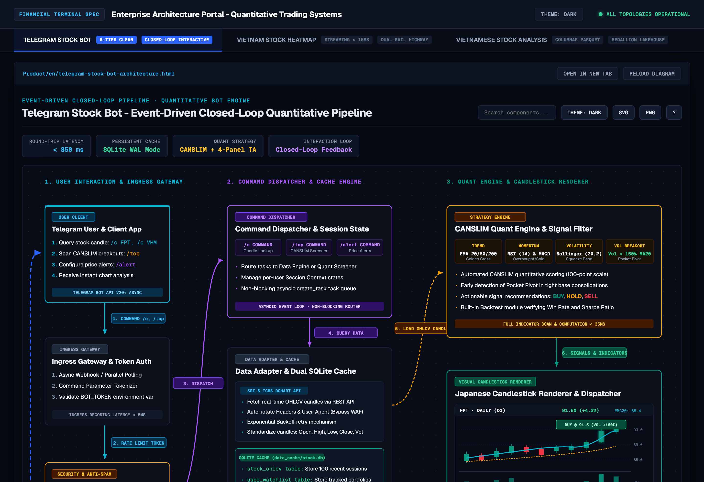
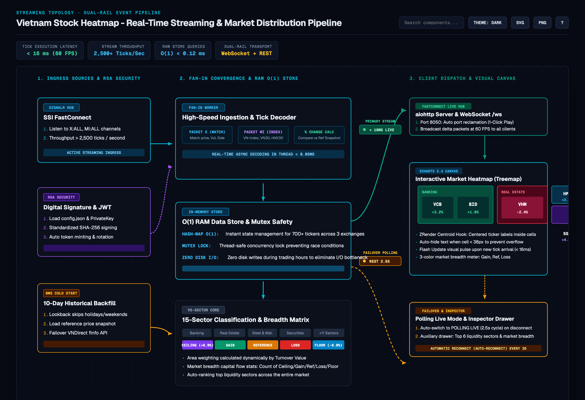
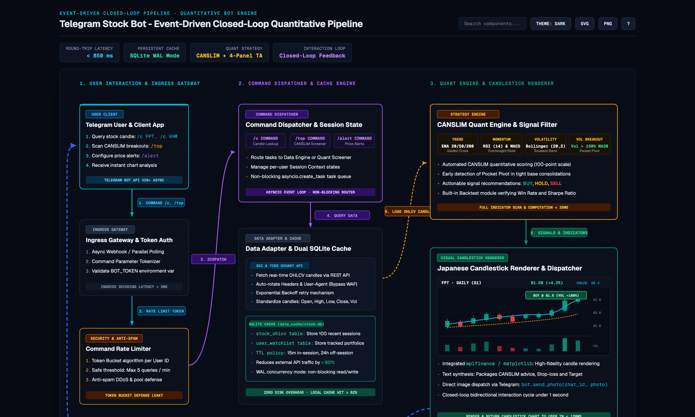
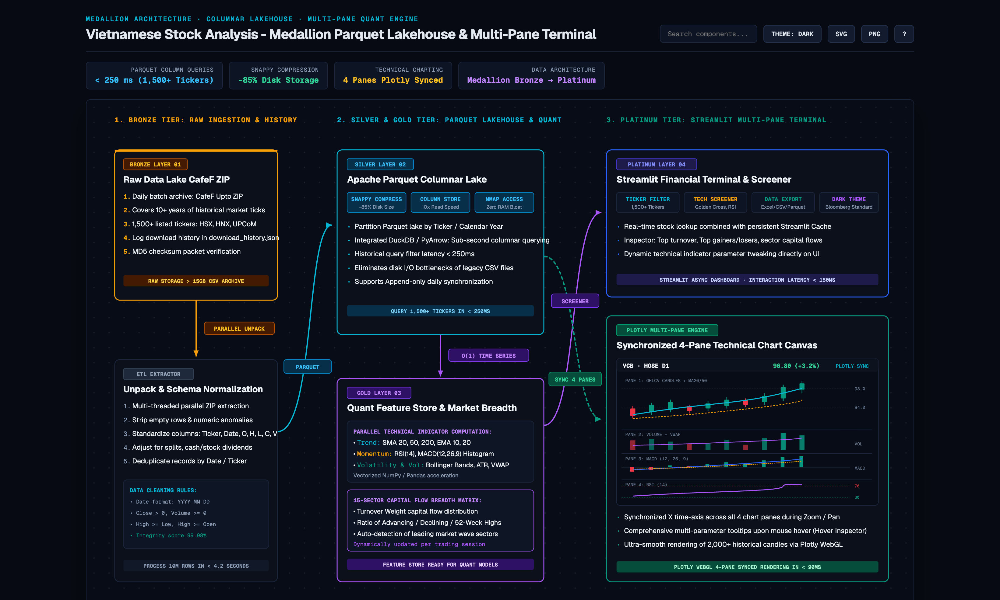
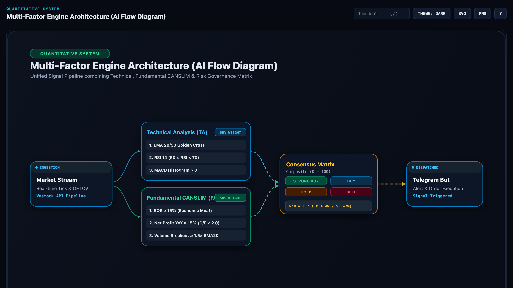
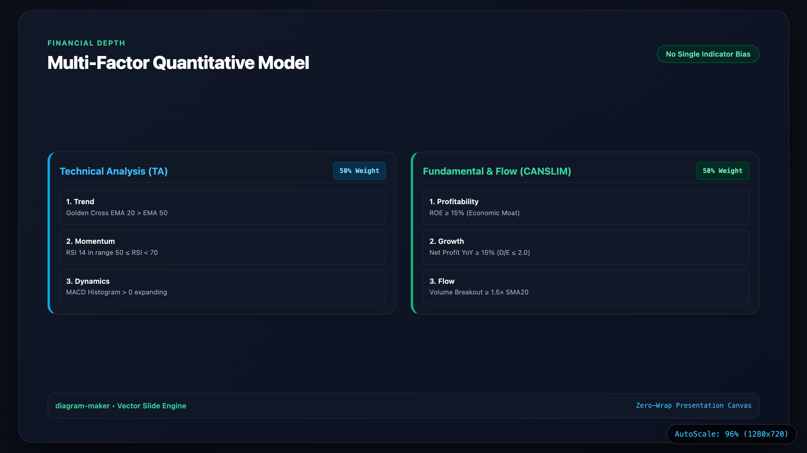

<p align="center">
  <a href="./README.md">Tiếng Việt</a> · <strong>English</strong>
</p>

<p align="center">
  
  
  
  
  
  
</p>

# diagram-maker

**Institutional Vector Architecture & Flowchart Engine (Zero External Dependencies)**

`diagram-maker` is an institutional-grade vector diagram engine and Diagram-as-Code compiler built entirely on the Python Standard Library. It compiles declarative JSON Abstract Syntax Tree (AST) specifications into publication-ready system architectures, data pipelines, and interactive technical presentations.

Unlike generic charting packages that rely on unpredictable force-directed physics or external Node.js renderers, `diagram-maker` combines deterministic geometric routing, automatic port spreading, and high-contrast institutional typography to deliver self-contained, responsive artifacts.

---

## Interactive Architecture Showcase Portal

All flagship production architectures are integrated into a centralized interactive portal featuring dynamic tab navigation, live inspector cards, and responsive auto-scaling.

[](Product/en/index.html)

*Interactive Architecture Portal ([Product/en/index.html](Product/en/index.html)) with integrated topology switching, real-time metrics bar, and standalone inspection controls.*

---

## Production Architectural Topologies

To demonstrate engine performance under real-world conditions with dense data flows, `diagram-maker` includes production-grade case studies from modern financial data platforms.

### 1. Streaming Fan-In & Dual-Rail Pipeline

High-throughput, real-time ingestion topology processing over 2,500 market ticks per second with asymmetric fan-in convergence and dual-rail WebSocket/REST transport.



* **Specification Source:** [`specs/projects/en/vietnam_stock_heatmap.json`](specs/projects/en/vietnam_stock_heatmap.json)
* **Interactive Web Artifact:** [**Product/en/vietnam-stock-heatmap-architecture.html**](Product/en/vietnam-stock-heatmap-architecture.html)
* **Core Characteristics:** Multi-source ingress authentication, In-Memory RAM Store with O(1) state resolution (< 0.12 ms), integrated micro-treemap component.

---

### 2. Event-Driven Closed-Loop Pipeline

Two-way interactive pipeline featuring token bucket rate limiting, asynchronous quant routing, and a feedback highway.



* **Specification Source:** [`specs/projects/en/telegram_stock_bot.json`](specs/projects/en/telegram_stock_bot.json)
* **Interactive Web Artifact:** [**Product/en/telegram-stock-bot-architecture.html**](Product/en/telegram-stock-bot-architecture.html)
* **Core Characteristics:** Sub-400ms end-to-end response budget, per-user token bucket spam defense, inline 4-panel Candlestick OHLCV micro-charting.

---

### 3. Medallion Columnar Lakehouse

Four-tier analytical data lakehouse architecture handling over 10 years of historical trading data across 1,500+ listed equities.



* **Specification Source:** [`specs/projects/en/vietnamese_stock_analysis.json`](specs/projects/en/vietnamese_stock_analysis.json)
* **Interactive Web Artifact:** [**Product/en/vietnamese-stock-analysis-architecture.html**](Product/en/vietnamese-stock-analysis-architecture.html)
* **Core Characteristics:** Bronze raw staging, Silver Snappy Parquet storage (-85% disk footprint, 10x read speed), Gold DuckDB/PyArrow vectorized OLAP, Platinum 4-pane visual analytics.

---

### 4. Multi-Tier Column Topology & Technical Slide Deck

The engine features specialized orthogonal columnar compilers (4-tier and 5-tier) and widescreen 16:9 technical presentation deck renderers.

| Orthogonal Column Topology (4-Tier / 5-Tier) | Technical Slide Presentation (16:9 Glassmorphic) |
| :--- | :--- |
| [](output/en/sample_diagram.html) | [](output/en/sample_slide.html) |

*Left: Orthogonal column architecture ([output/en/sample_diagram.html](output/en/sample_diagram.html)) with deterministic port spreading and dynamic Bezier routing. Right: Technical presentation slide ([output/en/sample_slide.html](output/en/sample_slide.html)) in 16:9 glassmorphic layout.*

---

## Architectural Principles & Capabilities

| Principle | Technical Implementation | Practical Benefit |
| :--- | :--- | :--- |
| **Deterministic Port Spreading** | Distributes parallel incoming/outgoing connections along the node boundary using calculated Y-offsets. | Eliminates line collisions and overlap when multiple connections target the same component. |
| **Zero Runtime Dependencies** | Implemented using only Python standard library modules (`math`, `re`, `json`, `sys`, `pathlib`, `argparse`). | Zero installation friction; runs instantly in any environment from Python 3.10+ without `npm` or `pip` compilation chains. |
| **Institutional Terminal Design** | High-contrast Neo-Dark (`#070a12`) and Light (`#f8fafc`) palettes, subtle borders (`#1b253b`), and `Geist Mono` typography. | Information density and visual authority aligned with institutional financial software (Bloomberg, TCBS, TradingView). |
| **Deterministic AST Validation** | Schema validation, node identifier uniqueness verification, and dangling connection detection. | Enforces structural integrity before compilation; invalid graphs fail with machine-readable diagnostics. |
| **Self-Contained Deliverables** | Generates standalone HTML files containing vector SVGs, CSS variables, and zero external script calls. | Instant portability; render in any browser, embed in iframes, share offline, or export to high-res PNG/SVG. |

---

## Interactive Viewer Capabilities

Every generated HTML document embeds a standalone interactive runtime operating entirely client-side without external dependencies:

| Control / Action | Keyboard Shortcut | Functionality |
| :--- | :---: | :--- |
| **Component Search** | <kbd>/</kbd> | Instant fuzzy search highlighting matching nodes and dimming unrelated components. |
| **Theme Toggle** | <kbd>T</kbd> | Toggles between Institutional Dark (`#070a12`) and Institutional Light (`#f8fafc`) palettes. |
| **Reach Tracing** | Click Node | Highlights all upstream and downstream connections for the selected component. |
| **Clear Selection** | <kbd>ESC</kbd> | Clears active node selection, restores all visual elements, and closes open dialogs. |
| **Export Vector SVG** | <kbd>Alt</kbd> + <kbd>S</kbd> | Serializes the complete vector SVG document and triggers direct client download. |
| **Export Retina PNG** | <kbd>Alt</kbd> + <kbd>P</kbd> | Renders SVG to an offscreen Canvas at 2x resolution and exports a crisp raster PNG. |
| **Shortcuts Modal** | <kbd>?</kbd> | Displays the on-screen shortcut reference dialog. |

---

## Multi-Format Deliverables Matrix

| Deliverable Format | Primary Use Case | Resolution & Scalability | Interactivity |
| :--- | :--- | :--- | :--- |
| **Interactive Web (`.html`)** | Architecture documentation, client portals, internal presentations. | Infinite vector resolution with Auto-Scale Canvas coordinator. | Full: Search (`/`), Theme toggle (`T`), Reach Tracing, SVG/PNG export. |
| **Vector Graphic (`.svg`)** | Technical papers, Figma / Illustrator editing, Git commit history. | 100% mathematical vector paths without pixel distortion. | Static vector paths; zero-wrap text rendering. |
| **Retina Image (`.png`)** | Slide decks, executive briefings, social previews (OpenGraph). | Ultra-high definition (@2x / @3x, up to 2880×1972). | High-contrast static preview. |

---

## Competitive Benchmark Matrix

| Evaluation Metric | diagram-maker | tt-a1i/archify | Mermaid.js | Graphviz (dot) | Draw.io (manual) |
| :--- | :---: | :---: | :---: | :---: | :---: |
| **External Dependencies** | **Zero (Pure Python)** | Node.js / npm | Node.js / JS CDN | C binaries (`graphviz`) | Browser / Desktop GUI |
| **Port Collision Handling** | **Deterministic Port Spread** | Port Spread | Overlaps on center | Spline collisions | Manual arrangement |
| **Design Standard** | **Institutional Terminal** | Multi-preset | Generic web-flow | Monochromatic / 90s | User-dependent |
| **Validation Gate** | **Built-in (`validate`)** | Built-in (`validate`) | Parse errors only | Syntax check only | None |
| **Offline Portability** | **Self-Contained HTML** | Self-Contained HTML | Requires JS runtime | Requires PostScript/dot | Proprietary XML |
| **Client-Side Image Export** | **1-Click SVG & PNG (2x)** | Export menu | Browser extension | CLI commands only | File menu export |
| **Interactive Reach Tracing**| **Upstream & Downstream** | Upstream & Downstream | None | None | None |

---

## CLI Reference & Quickstart

### 1. Verification & Validation Gate

Verify structural integrity, schema conformance, and connection references across all specifications:

```bash
# Validate all specifications in specs/ (Vietnamese and English)
python3 main.py validate --all

# Validate a specific English architecture specification
python3 main.py validate specs/projects/en/vietnam_stock_heatmap.json
```

Output:
```text
=== diagram-maker: AST & Schema Validation Gate ===
SPECIFICATION                        TYPE         NODES/METRICS    STATUS
--------------------------------------------------------------------------
telegram_stock_bot.json              topology     4 metrics        [PASS]
vietnam_stock_heatmap.json           topology     4 metrics        [PASS]
vietnamese_stock_analysis.json       topology     4 metrics        [PASS]
sample_diagram.json                  diagram      5n / 5e          [PASS]
sample_slide.json                    slide        2 branches       [PASS]
en/telegram_stock_bot.json           topology     4 metrics        [PASS]
en/vietnam_stock_heatmap.json        topology     4 metrics        [PASS]
en/vietnamese_stock_analysis.json    topology     4 metrics        [PASS]
en/sample_diagram.json               diagram      5n / 5e          [PASS]
en/sample_slide.json                 slide        2 branches       [PASS]
...
--------------------------------------------------------------------------
Result: 15/15 specifications valid.
```

### 2. Compilation & Build

Compile specifications into standalone interactive HTML documents:

```bash
# Batch compile all specifications in specs/
python3 main.py --all

# Compile a single English specification
python3 main.py specs/samples/en/sample_diagram.json -o output/en/sample_diagram.html

# Compile with Institutional Light theme by default
python3 main.py specs/samples/en/sample_diagram.json -o output/en/sample_diagram_light.html --theme light
```

---

## Declarative JSON AST Specification Guide

`diagram-maker` separates data topology from graphical rendering. Below are the canonical formats for supported architectures.

### 1. Orthogonal Column Topology AST (`columns`)

```json
{
  "title": "Distributed Ingestion Cluster",
  "category": "DATA INFRASTRUCTURE",
  "subtitle": "Orthogonal Multi-Tier Architecture",
  "columns": [
    {
      "title": "INGRESS TIER",
      "nodes": [
        {
          "id": "lb_gateway",
          "title": "Edge Gateway",
          "badge": "PORT 443",
          "color": "sky",
          "items": ["TLS 1.3 Termination", "Token Bucket Rate Limiter"]
        }
      ]
    },
    {
      "title": "COMPUTE TIER",
      "nodes": [
        {
          "id": "core_engine",
          "title": "Quant Routing Engine",
          "badge": "ACTIVE",
          "color": "emerald",
          "items": ["In-Memory Event Bus", "Sub-millisecond Dispatch"]
        }
      ]
    }
  ],
  "connections": [
    {
      "from": "lb_gateway",
      "to": "core_engine",
      "color": "emerald",
      "animated": true
    }
  ]
}
```

### 2. Streaming Topology AST (`topology`)

```json
{
  "topology": "streaming",
  "title": "Market Data Fan-In Pipeline",
  "eyebrow": "REAL-TIME STREAMING · SUB-16MS",
  "metrics": [
    { "label": "Throughput", "value": "> 2,500 tick/s", "color": "#38bdf8" },
    { "label": "Memory Latency", "value": "< 0.12 ms", "color": "#34d399" }
  ],
  "footer_notes": [
    { "title": "In-Memory Store", "desc": "State resolution with O(1) complexity via ring buffers.", "color": "#06b6d4" }
  ]
}
```

---

## Project Structure

```text
diagram-maker/
├── main.py                        # Root CLI entrypoint (validate, compile, --all)
├── requirements.txt               # Dependencies declaration (0 external runtime dependencies)
├── LICENSE                        # MIT License
├── README.md                      # Vietnamese Documentation
├── README_EN.md                   # English Documentation (Institutional Standard)
├── assets/                        # High-resolution showcase assets
│   ├── product_portal_overview.png
│   ├── vietnam_stock_heatmap.png
│   ├── telegram_stock_bot.png
│   ├── vietnamese_stock_analysis.png
│   ├── column_architecture_showcase.png
│   ├── presentation_slide_showcase.png
│   └── en/                        # English Retina screenshots (@2x)
│       ├── product_portal_overview.png
│       ├── vietnam_stock_heatmap.png
│       ├── telegram_stock_bot.png
│       ├── vietnamese_stock_analysis.png
│       ├── column_architecture_showcase.png
│       └── presentation_slide_showcase.png
├── Product/                       # Interactive architecture showcase portal
│   ├── index.html                 # Centralized multi-tab architecture console (VI)
│   ├── vietnam-stock-heatmap-architecture.html
│   ├── telegram-stock-bot-architecture.html
│   ├── vietnamese-stock-analysis-architecture.html
│   └── en/                        # Centralized multi-tab architecture console (EN)
│       ├── index.html
│       ├── vietnam-stock-heatmap-architecture.html
│       ├── telegram-stock-bot-architecture.html
│       └── vietnamese-stock-analysis-architecture.html
├── schemas/                       # Formal JSON Schema specifications
│   ├── diagram_spec.schema.json
│   └── slide_spec.schema.json
├── specs/                         # Declarative JSON AST specifications
│   ├── projects/                  # Production pipelines (VI & EN)
│   │   ├── vietnam_stock_heatmap.json
│   │   ├── telegram_stock_bot.json
│   │   ├── vietnamese_stock_analysis.json
│   │   └── en/                    # English production specifications
│   └── samples/                   # Canonical template samples (VI & EN)
│       ├── sample_diagram.json
│       ├── sample_slide.json
│       └── en/                    # English template samples
├── output/                        # Standalone compiled vector HTML deliverables
│   ├── *.html                     # Vietnamese compiled deliverables
│   └── en/                        # English compiled deliverables
└── src/                           # Pure Python compilation engine
    ├── cli.py                     # Unified CLI dispatcher & argument parser
    ├── validator.py               # Deterministic AST & connection integrity validator
    ├── engine.py                  # Multi-topology runtime dispatcher
    ├── compiler.py                # Orthogonal columnar vector compiler (port spread & bezier)
    ├── slide_compiler.py          # 16:9 presentation slide compiler
    ├── core/                      # Geometry, color palettes, micro-mockups
    └── topologies/                # Streaming, closed-loop, and medallion compilers
```

---

## License

This project is licensed under the **MIT License** - see the [LICENSE](LICENSE) file for details.
